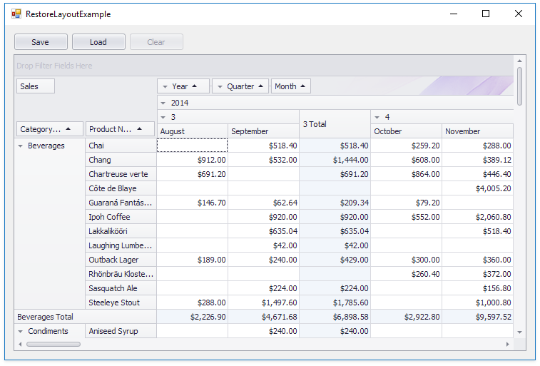

<!-- default badges list -->

<!-- default badges end -->

# Pivot Grid for WinForms - How to Save and Restore the Pivot Grid Layout

This example demonstrates how to restore the Pivot Grid layout and row/column state.

The **Save** button uses the [PivotGridControl.SaveLayoutToStream](https://docs.devexpress.com/WindowsForms/DevExpress.XtraPivotGrid.PivotGridControl.SaveLayoutToStream.overloads) and [PivotGridControl.SaveCollapsedStateToStream](https://docs.devexpress.com/WindowsForms/DevExpress.XtraPivotGrid.PivotGridControl.SaveCollapsedStateToStream(System.IO.Stream)) methods to save the layout and field values' collapsed state to memory streams.

The **Load** button uses the [PivotGridControl.RestoreLayoutFromStream ](https://docs.devexpress.com/WindowsForms/DevExpress.XtraPivotGrid.PivotGridControl.RestoreLayoutFromStream.overloads) and [PivotGridControl.LoadCollapsedStateFromStream](https://docs.devexpress.com/WindowsForms/DevExpress.XtraPivotGrid.PivotGridControl.LoadCollapsedStateFromStream(System.IO.Stream)) methods to restore the saved layout and column/row state.

The **Clear** button clears the field collection.

## Files to Review

[Form1.cs](./CS/XtraPivotGrid_RestoreLayoutExample/Form1.cs) (VB: [Form1.vb](./VB/XtraPivotGrid_RestoreLayoutExample/Form1.vb))

## Documentation

[Save and Restore Layout](https://docs.devexpress.com/WindowsForms/1806/controls-and-libraries/pivot-grid/layout/save-and-restore-layout)

## More Examples

[ASPxPivotGrid - How to Manage Pivot Grid Layout](https://github.com/DevExpress-Examples/aspxpivotgrid-layout-upgrade-event)
<!-- feedback -->
## Does this example address your development requirements/objectives?

 

(you will be redirected to DevExpress.com to submit your response)
<!-- feedback end -->
